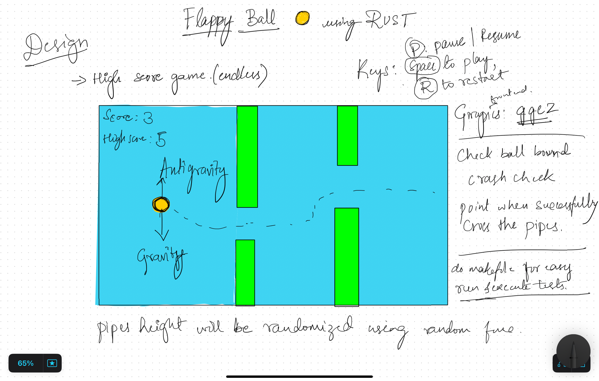

# Flappy Ball Game

A fun endless high-score game built using Rust and `ggez`.

## Controls
- **SPACE**: Jump
- **P**: Pause/Resume game
- **R**: Restart game

## Gameplay Design

## How to Run
1. Clone the repository.
2. Use `cargo run` to start the game.
3. Use `make test` to run the unit tests.

Enjoy playing the Flappy Ball game and beat your high score!

## Author
Sandeep Chikkapla Siddappa
